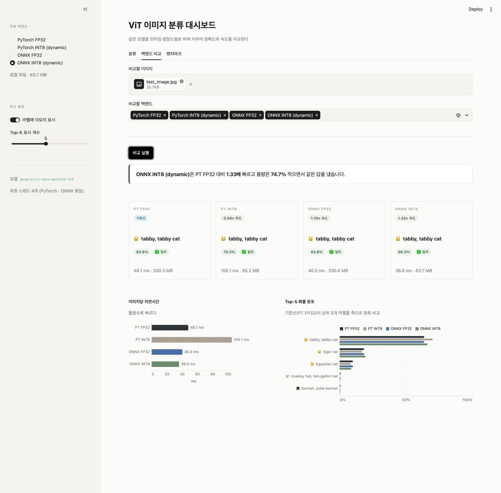
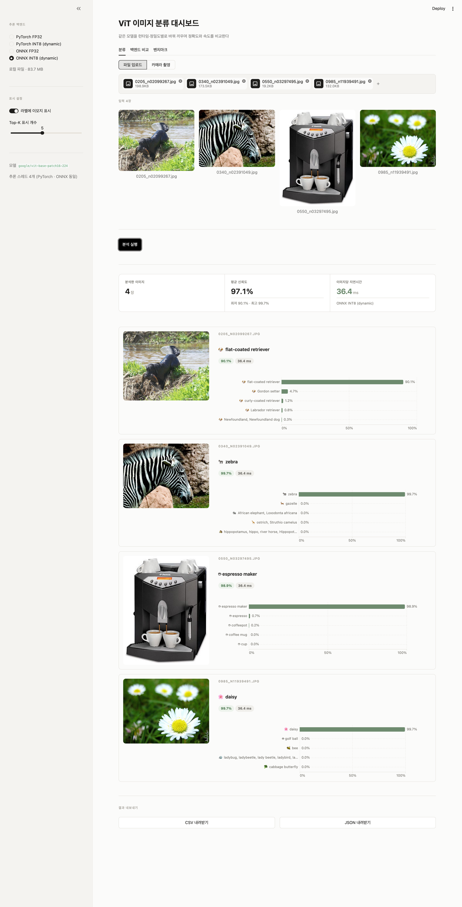
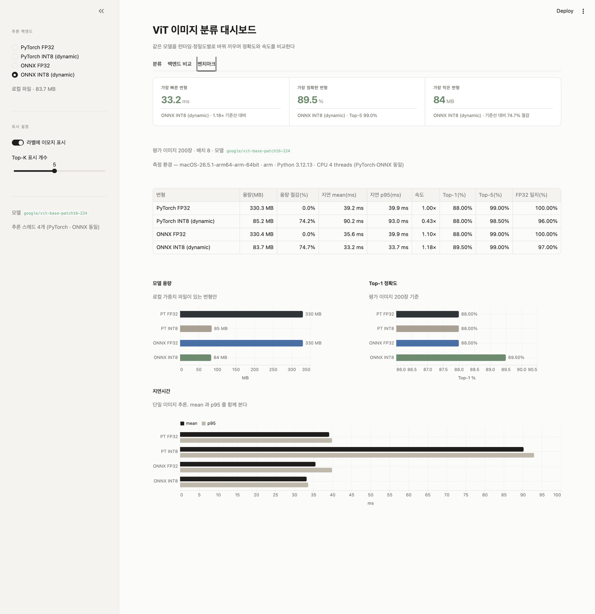

# ViT Image Classification Dashboard

**라이브 데모 → https://vit.lucenta.duckdns.org**
(OCI Ampere A1 / Ubuntu 24.04 aarch64 / Docker. 4종 백엔드 모두 사용 가능)

`google/vit-base-patch16-224` 로 이미지를 분류하는 Streamlit 대시보드.

단순 분류 데모가 아니라, **같은 모델을 런타임(PyTorch / ONNX Runtime)과
정밀도(FP32 / INT8) 조합으로 바꿔 끼우며 정확도와 지연시간의 트레이드오프를
실측으로 비교**하는 것이 이 프로젝트의 목적이다.



> 같은 고양이 사진을 네 백엔드에 통과시킨 결과. 넷 다 `tabby cat` 으로 같은 답을
> 냈지만 소요 시간은 36.0ms 에서 105.1ms 까지 벌어진다.

---

## 화면

### 백엔드 비교

이 프로젝트의 차별화 지점. 이미지 한 장을 선택한 백엔드들에 모두 통과시켜
**예측이 서로 일치하는지**와 **기준선 대비 속도 배율**을 나란히 놓는다.
위 스크린샷에서 PyTorch INT8 이 `0.46× 속도` 로 표시된 것에 주목 — 양자화했는데
느려진 경우다. 요약 문장은 화면에 뜬 측정값에서 계산한다.

### 분류

이미지 여러 장을 배치 추론한다. 업로드한 것을 전부 미리 보여주고, Top-K 막대
차트와 이미지당 지연시간을 함께 낸다. 결과는 CSV / JSON 으로 내려받을 수 있다.



### 벤치마크

`results/benchmark.json` 을 표와 차트로 렌더링한다. 측정 환경(OS·Python·스레드 수)을
함께 적어둔다 — 다른 CPU 에서 잰 수치는 비교 의미가 없기 때문이다.



---

## 핵심 결과

실제 배포 서버(OCI Ampere A1, Neoverse-N1 4 OCPU), 4스레드 고정,
ImageNet-1k 에서 균등 추출한 200장 기준.

| 변형 | 용량 | 용량 절감 | 지연 mean | 지연 p95 | 속도 | Top-1 | Top-5 | FP32 일치 |
|---|---:|---:|---:|---:|---:|---:|---:|---:|
| PyTorch FP32 | 330.3 MB | 0.0% | 272.9 ms | 409.7 ms | 1.00x | 88.0% | 99.0% | 100.0% |
| PyTorch INT8 (dynamic) | 85.2 MB | 74.2% | 467.0 ms | 476.0 ms | **0.58x** | 87.5% | 99.0% | 96.5% |
| ONNX FP32 | 330.4 MB | -0.0% | 273.6 ms | 319.4 ms | 1.00x | 88.0% | 99.0% | 100.0% |
| **ONNX INT8 (dynamic)** | **83.7 MB** | **74.7%** | **96.0 ms** | 97.3 ms | **2.84x** | 88.5% | 98.0% | 96.5% |

재현: `python scripts/run_benchmark.py --n 200 --runs 30 --threads 4`
원본 데이터: [`results/benchmark.json`](results/benchmark.json) (배포 서버) ·
[`results/benchmark-macos-arm.json`](results/benchmark-macos-arm.json) (개발 머신)

### 여기서 읽어야 할 것

**1. 양자화는 항상 빠르지 않다 — 하드웨어가 결론을 뒤집는다.**

세 플랫폼에서 같은 코드로 측정한 지연시간 배율이다.

| 지연시간 배율 (각 환경의 FP32=1.00) | Windows x86<br>fbgemm | macOS ARM (M5)<br>qnnpack | Linux ARM (Neoverse-N1)<br>qnnpack |
|---|---:|---:|---:|
| PyTorch INT8 | 1.65x | **0.43x** | **0.58x** |
| ONNX INT8 | 1.81x | 1.18x | **2.84x** |

PyTorch 동적 INT8 은 **ARM 두 곳 모두에서 FP32 보다 느렸다.** 용량은 74% 줄었는데
속도는 손해다. ARM 의 양자화 백엔드인 `qnnpack` 은 ViT 처럼 큰 Linear 가 연속되는
구조에서 양자화·역양자화 오버헤드를 FP32 경로로 상쇄하지 못한다. 반면 x86(`fbgemm`)
에서는 1.65배 빨랐다 ([vit-onnx-optimization](https://github.com/carsy078-maker/vit-onnx-optimization)).
"INT8 양자화 = 가속" 이라는 통념이 플랫폼에 따라 그대로 뒤집힌다.

**2. 최적화 효과는 배포 환경에서 재야 한다.**

ONNX INT8 의 이득이 개발 머신(M5)에서는 1.18배였는데 **실제 배포 하드웨어에서는
2.84배**였다. M5 는 FP32 경로가 워낙 빨라 INT8 로 얻을 여지가 적었던 반면,
서버급 Neoverse-N1 에서는 격차가 크게 벌어진다. 개발 머신 수치만 보고
"별 차이 없네" 라고 판단했다면 실제 서비스에서 **272.9ms → 96.0ms** 의 개선을
놓쳤을 것이다.

**3. ONNX Runtime 은 세 플랫폼 모두에서 안전한 선택이었다.**

ONNX INT8 은 어디서도 기준선보다 느려지지 않으면서 용량을 74.7% 줄였고,
FP32 와 Top-1 예측이 96.5% 일치했다. 그래서 이 프로젝트의 **배포 기본 백엔드**다.

**4. 정확도 수치의 한계를 분명히 해둔다.**

- 200장은 표본이 작다. Top-1 의 표준오차가 ±2%p 수준이라, 표의 88.0% 와 88.5%
  차이를 "양자화가 정확도를 올렸다"고 읽으면 안 된다. 노이즈 범위다.
- 평가에 쓴 이미지는 ImageNet 공식 validation set 이 아니라 클래스당 1장짜리
  샘플 저장소다. ViT-Base 의 공식 Top-1(81.1%, val 50,000장)과 직접 비교할 수 없다.
- 변형 간 **상대 비교**에는 유효하다. 네 변형이 완전히 동일한 입력을 받기 때문이다.

---

## 설계에서 신경 쓴 것

### 환경별 백엔드 폴백

FP32 가중치는 한 종에 330MB 라 배포 이미지에 넣을 수 없다. 그래서 가중치
확보 경로를 세 갈래로 두고, 쓸 수 있는 백엔드를 런타임에 판정한다.

| 경로 | 설명 |
|---|---|
| 로컬 `models/` | `scripts/export_models.py` 로 내보낸 파일 |
| Hugging Face Hub | 배포 환경에서 ONNX INT8(84MB)만 내려받는다 |
| 원본에서 즉석 구성 | PyTorch 변형은 파일 없이 `from_pretrained` 로 만든다 |

쓸 수 없는 변형은 숨기지 않고 **사유와 함께** UI에 남긴다
(`"이 환경에는 torch 가 없다 (ONNX 전용 배포)"`). 판정 로직은
[`backends.variant_status()`](src/vision_dashboard/backends.py) 한곳에 모여 있고,
UI 는 결과를 읽기만 한다.

### 배포 의존성에서 torch 를 뺐다

전처리를 transformers 의 PIL 백엔드로 고정해, 배포 환경은 **ONNX Runtime 만으로**
동작한다. `requirements.txt` 에 torch 가 없다.

torchvision 백엔드와 PIL 백엔드는 리사이즈 구현이 미묘하게 다르다(같은 이미지에서
최대 0.008 차이). 백엔드를 고정하지 않으면 개발 환경과 배포 환경이 서로 다른 입력을
받게 되고, 위의 벤치마크 수치가 배포 환경에서 재현되지 않는다.
[CI 가 이 조합을 매번 검증한다](.github/workflows/ci.yml) — 배포 의존성에 torch 가
섞이면 빌드가 깨진다.

### 추론 결과 캐싱

Streamlit 은 위젯이 바뀔 때마다 스크립트를 처음부터 다시 실행한다. 확률 1000개를
통째로 들고 있으므로 **Top-K 개수를 바꾸거나 이모지를 켜고 꺼도 재추론하지 않는다.**
재추론은 새 이미지가 들어오거나 백엔드를 바꿀 때만 일어난다.

### 공정한 측정

PyTorch 와 ONNX Runtime 의 스레드 수를 같은 값으로 강제한다. 기본값을 두면 각자
다른 수의 코어를 잡아, 런타임 비교가 아니라 스레드 수 비교가 되어 버린다.
지연시간은 warmup 후 30회 반복해 mean / p50 / p95 를 낸다.

### 평가 표본 추출

ImageNet 클래스 인덱스는 의미 순으로 정렬돼 있다(0~397 이 대부분 동물, 그중 앞쪽은
어류·조류). 앞에서 200개를 자르면 사실상 "동물 분류기" 를 평가하게 되므로,
전체 1000 클래스에서 **균등 간격으로** 추출한다.

---

## 구조

```
app.py                       Streamlit 엔트리
src/vision_dashboard/
├── config.py                모델 변형 정의 · 실행 환경 프로파일
├── backends.py              런타임 추상화 (PyTorch/ONNX × FP32/INT8) · 가용성 판정
├── inference.py             이미지 로드 · 전처리 · 배치 추론 · 후처리
├── labels.py                ImageNet-1k 라벨 · 이모지 매핑
├── benchmarking.py          용량/지연/정확도 측정
└── ui/                      Streamlit 화면 (분류 · 백엔드 비교 · 벤치마크)
scripts/
├── export_models.py         4종 가중치 내보내기
├── download_samples.py      평가용 이미지 다운로드
├── run_benchmark.py         벤치마크 실행
└── capture_screenshots.py   README 스크린샷 캡처 (Playwright)
tests/                       pytest (60개, Streamlit AppTest 포함)
```

---

## 실행

### 로컬 (4종 전부)

```bash
python -m venv .venv && source .venv/bin/activate
pip install -r requirements-dev.txt

python scripts/export_models.py          # 가중치 4종 생성 (~830MB)
streamlit run app.py
```

### 배포 구성 재현 (ONNX 전용, torch 없음)

```bash
pip install -r requirements.txt
python scripts/export_models.py --only onnx_int8   # 별도 환경에서 미리 생성 필요
streamlit run app.py
```

Hub 에 ONNX 가중치를 올려두고 내려받게 하려면:

```bash
export VD_HUB_ONNX_REPO="<사용자명>/vit-base-onnx-int8"
```

### Docker

```bash
docker compose up -d --build                  # 앱만 (127.0.0.1:8501 바인딩)
docker compose --profile standalone up -d     # 앞단 Caddy 까지 함께
```

기본 구성은 앱을 루프백에만 연다. 호스트에 이미 웹 서버가 있는 서버에서 컨테이너가
80 을 뺏지 않도록 한 것으로, 그런 환경에서는 기존 프록시에 한 블록만 더하면 된다.

```caddy
vit.example.com {
    reverse_proxy 127.0.0.1:8501
}
```

[Dockerfile](Dockerfile) 은 다단계 빌드이고 최종 타깃이 둘이다. builder 단계에서만
torch 를 설치해 가중치를 내보내고, 런타임 이미지는 목적에 따라 갈린다.

| 타깃 | 담는 것 | 쓸 수 있는 백엔드 | 용도 |
|---|---|---|---|
| `runtime-onnx` | ONNX INT8(84MB) + ONNX Runtime | 2종 중 1종 | 메모리가 빠듯한 PaaS |
| `runtime-full` | 4종 전부 + torch | **4종 전부** | 여유 있는 서버 (compose 기본값) |

```bash
docker build --target runtime-onnx -t vision-dashboard:onnx .   # 경량
```

어느 쪽이든 앱 코드는 같다. 쓸 수 있는 백엔드가 환경마다 달라지는 것을
`backends.variant_status()` 가 판정하고, 못 쓰는 변형은 사유와 함께 화면에 남는다.

### 벤치마크

```bash
python scripts/download_samples.py --n 200
python scripts/run_benchmark.py --n 200 --runs 30 --threads 4
```

### 테스트

```bash
pytest -q          # 60 passed
ruff check .
```

모델 가중치 없이 도는 테스트다. 백엔드는 목으로 대체하고, 배치 분할·순서 보존·
예외 처리·가용성 판정 같은 배선을 검증한다.

UI 는 Streamlit `AppTest` 로 검증한다. 그중 하나는 **Top-K 슬라이더와 이모지
토글을 움직여도 추론 함수가 다시 호출되지 않는지** 를 호출 횟수로 확인한다 —
원본 앱에서 실제로 깨져 있던 동작이라 회귀 방지용으로 고정해 뒀다.

---

## 환경 변수

| 이름 | 기본값 | 설명 |
|---|---|---|
| `VD_HUB_ONNX_REPO` | (없음) | ONNX INT8 가중치를 받을 Hugging Face 저장소 |
| `VD_CPU_THREADS` | `min(4, 코어 수)` | PyTorch/ONNX 공통 스레드 수 |

---

## 기술 스택

Python 3.12+ · Streamlit · ONNX Runtime · PyTorch · Hugging Face Transformers ·
Altair · pytest · GitHub Actions · Docker

---

## 라이선스

MIT
